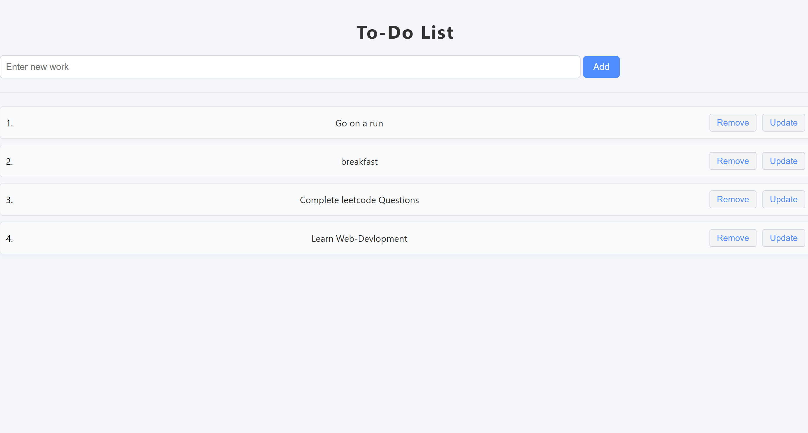

<<<<<<< HEAD
# to-do-app
this is a simple to do app 
=======
# To-Do List Web App

A simple, interactive To-Do List web application built with HTML, CSS, and JavaScript.  
You can add, update, remove, and list your tasks in a clean and modern interface.

## Features

- Add new tasks
- Update existing tasks
- Remove tasks
- View your to-do list
- Responsive and clean UI

## How to Use

1. **Clone or download this repository.**
2. Place all files (`index.html`, `style.css`, and optionally `icon.png`) in the same folder.
3. Open `index.html` in your web browser.
4. Use the dropdown to select "Add" or "List":
    - **Add:** Enter a new task and click "Add".
    - **List:** View, update, or remove your tasks.

## Project Structure

```
/To-do-List
  ├── index.html
  ├── style.css
  └── (optional) icon.png
```

## Screenshots

 <!-- Add a screenshot if you have one -->

## Credits

Made by Harsh Pathak.

---

Feel free to improve or customize this project!
>>>>>>> 350cfedfb18be74b77ba8c21cff91addedd06e46
